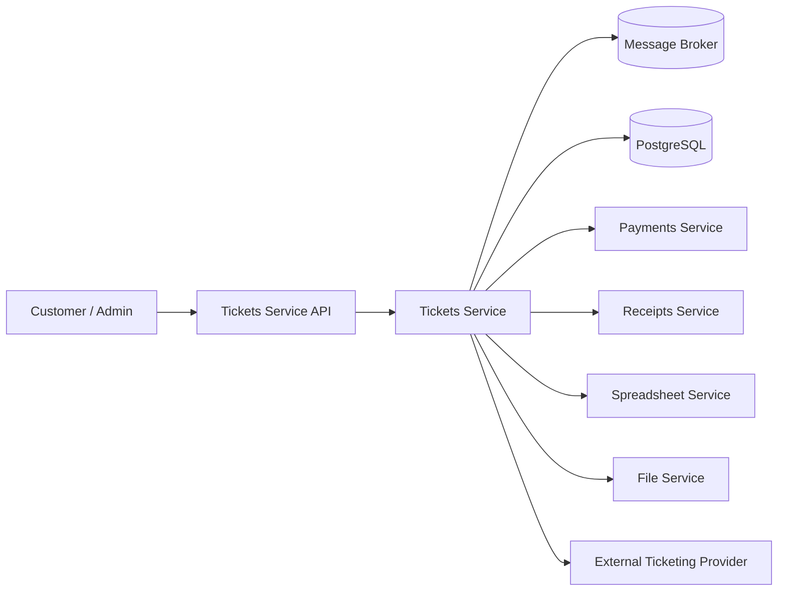

# System Context

```mermaid
flowchart LR
    U[Customer / Admin] --> API[Tickets Service API]
    API --> APP[Tickets Service]

    APP --> B[(Message Broker)]
    APP --> DB[(PostgreSQL)]
    APP --> PAY[Payments Service]
    APP --> REC[Receipts Service]
    APP --> SHEET[Spreadsheet Service]
    APP --> FILES[File Service]
    APP --> EXT[External Ticketing Provider]
```