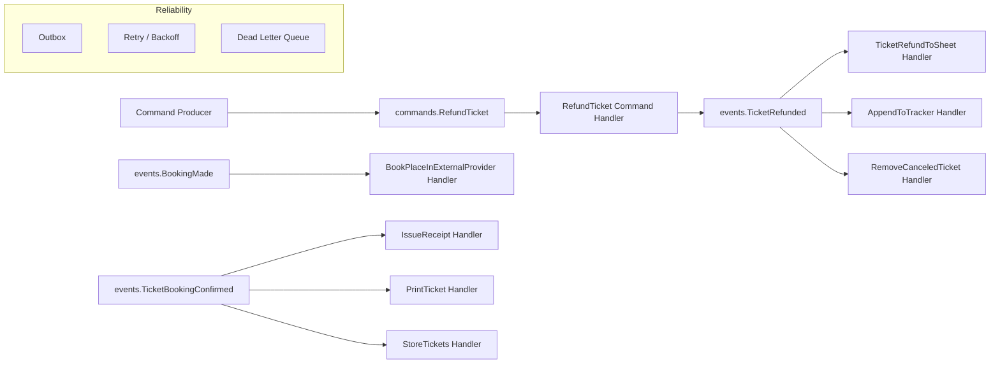

### `docs/architecture/topology.md`
```markdown
# Messaging Topology


```mermaid
flowchart LR
    C1[Command Producer] --> TC[commands.RefundTicket]
    TC --> H1[RefundTicket Command Handler]
    H1 --> E1[events.TicketRefunded]

    E1 --> EH1[TicketRefundToSheet Handler]
    E1 --> EH2[AppendToTracker Handler]
    E1 --> EH3[RemoveCanceledTicket Handler]

    E2[events.BookingMade] --> EH4[BookPlaceInExternalProvider Handler]
    E3[events.TicketBookingConfirmed] --> EH5[IssueReceipt Handler]
    E3 --> EH6[PrintTicket Handler]
    E3 --> EH7[StoreTickets Handler]

    subgraph Reliability
      OB[Outbox]
      RETRY[Retry / Backoff]
      DLQ[Dead Letter Queue]
    end
```
```